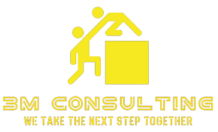

# 3M CONSULTING
### WE TAKE THE NEXT STEP TOGETHER

[](https://github.com/nduwarugirabruno/3MCDigital)

3M Consulting is a platform for bringing together customers and contractors.

It can be previewed on my GitHub repository here: https://github.com/nduwarugirabruno/3MCDigital

## Getting Started

To start building, clone this repository:

```bash
git clone https://github.com/nduwarugirabruno/3MCDigital.git
```

Once cloned, run the following to install dependencies and run the app:

```bash
cd /path/to/the/cloned/repository/folder
# open with your code editor for exemple IntelliJ IDEA or Visual Studio Code
idea ./
```

## Structure

We have 3 sub folders and the readme file:

```bash
links@links:~/IdeaProjects/3MConsulting$ ls
  3MC-Notification
  3MC-User
  EurekaServer
  README.md
```

- The first folder [3MC-Notification](3MC-Notification) is the Notification Service developed in Spring Boot x Spring Cloud framework
- The second folder [3MC-User](3MC-User) is the User Server developed in Spring Boot x Spring Cloud framework
- The third folder [EurekaServer](EurekaServer) is the Eureka Server developed in Spring Boot x Spring Cloud framework
- The last file is this [README.md](README.md) developed in Spring Boot x Spring Cloud framework

## Production

To build for production, run:

```bash
```

## Unit Tests

To run the unit tests once, run:

```bash
```
